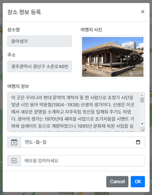
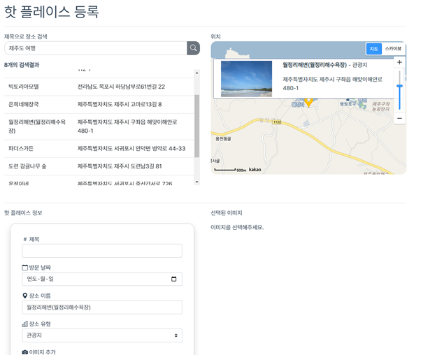
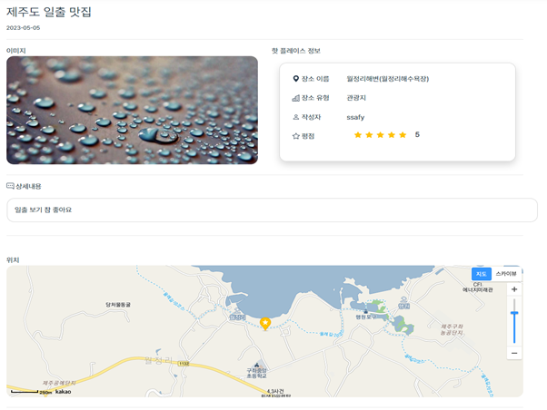

# 🛬 우리들의 여행 친구 Journey Buddy !!! 🛫

## 🔎 프로젝트 개요

- [공공데이터 포털](http://data.go.kr)의 오픈 API를 활용
- 한국관광공사의 [한국관광공사\_국문 관광정보 서비스\_GW](https://www.data.go.kr/data/15101578/openapi.do)를 데이터화 하여 mysql에서 DB로 관리
- 해당 DB에서 관광지 데이터를 추출하여 필요한 데이터 표시
- 관광지 검색 및 여행 계획, 핫 플레이스 공유 기능을 가진 여행 테마의 웹 사이트 제작

## 👩🏻 🧑🏻 팀원

- 연주원 (팀장) Front & Back
  - 로그인 및 회원관리
  - 마이페이지
  - 핫 플레이스
- 진병욱 (팀원) Front & Back
  - 관광지
  - 여행 계획
  - 공지사항

## 📣 프로젝트 목표

- 검색어를 기반으로 한 관광지 정보 도출 및 여행 계획, 핫 플레이스
- 스프링 시큐리티를 활용하여 전반적인 로그인 세션 관리
- 메인 공지사항을 이용한 공지사항 게시판
- 파일 업/다운로드를 활용한 마이페이지
- 카카오 API를 활용한 카카오 맵
- 네이버 API를 활용한 네이버 로그인

## ⚙ 사용 기술

### Front-End

### Back-End

### DataBase

### DevTool

## 💶 시스템 아키텍처

## 📄 산출물

- [설계서](https://1drv.ms/b/s!AobPN9o4gUEm-BmQWgMroxnS6eJk?e=HKT8CA)
- [ppt](https://1drv.ms/b/s!AobPN9o4gUEm-BqTYvv1QSp3W6Tr?e=y4dLmM)

## ERD Digaram

## 상세 기능

| 로그인                                   |
| ---------------------------------------- |
|  |

| 회원가입                                     |
| -------------------------------------------- |
|  |

| 공지사항                                      |
| --------------------------------------------- |
|  |

| 여행 게획 리스트                       |
| -------------------------------------- |
|  |

| 관광지                                   |
| ---------------------------------------- |
|  |

| 여행지 추가                                       |
| ------------------------------------------------- |
|  |

| 핫플레이스 등록                                           |
| --------------------------------------------------------- |
|  |

| 핫플레이스 상세보기                                               |
| ----------------------------------------------------------------- |
|  |

